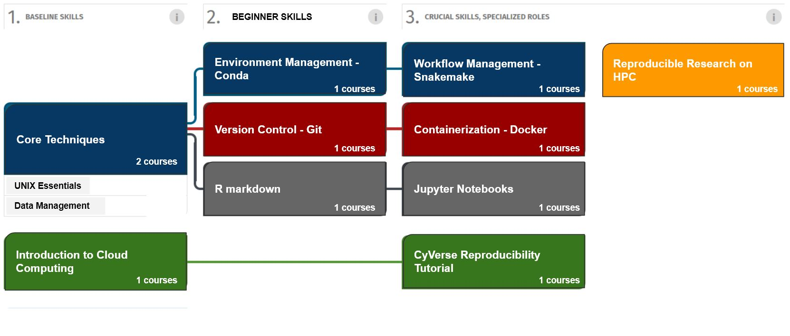
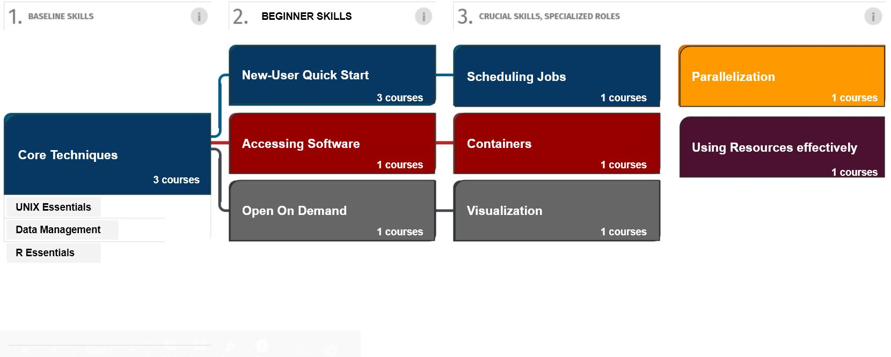
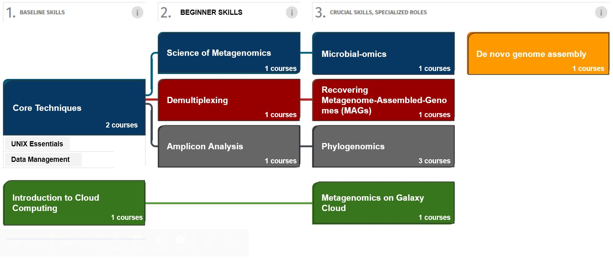

# Bioinformatics Roadmap
Biological research has become data intensive, recently the high throughput techniques produce massive sets of data at an ever increasing pace. 
These data is used to answer different biological questions using relevant bioinformatic skills. As a student or new researcher you need to understand the main 
computational biology domain knowledge to have a successful career in bioinformatics. A student or new researcher needs to equip himself/herself with an in-depth 
knowledge of the specific problem that is researched and gain essential ingredients of each discipline only to the extent required to address the research questions 
posed [[1]](https://bmcbioinformatics.biomedcentral.com/articles/10.1186/1471-2105-10-S15-S1). 

There are a wide range of research topics in the bioinformatics field. Becoming an expert of a given research topic is the first step on the steep climb to a successful career.
I am going to break down some of the major research areas/topics and the core skills required to conduct analysis.

- ## Reproducible research
The need for reproducibility is increasing dramatically as data analyses become more complex, involving larger datasets and more sophisticated computations. Reproducibility allows for people to focus on the actual content of a data analysis, rather than on superficial details reported in a written summary.

Reproducibility makes an analysis more useful to others because the data and code that actually conducted the analysis are available. This is required in all domains of bioinformatics as the skills enable you how to;
  - Organize data analysis in a reproducible manner
  - Write reproducible anlysis using the different available tools
  - Determine the reproducibility of an analysis
  - Publish reproducible documents in various channels
  
 The core skills of reproducible analysis are summarized in the figure below
 
 

- ## High performance computing
An HPC cluster consists of hundreds or thousands of compute servers that are networked together. Each server is called a node. The nodes in each cluster work in parallel with each other, boosting processing speed to deliver high-performance computing. High-performance computing (HPC) is the ability to process data and perform complex calculations at high speeds. It also involves parallel processing of data on distributed computing nodes.
The core skills required for execution are summarized in  the figure below;

- ## RNA-Seq 
RNA-seq (RNA-sequencing) is a technique that can examine the quantity and sequences of RNA in a sample using next-generation sequencing (NGS). Over the past few years, RNA sequencing (RNA-seq) has become an indispensable tool for transcriptome-wide analysis of differential gene expression and differential splicing of mRNAs.

Different skills are required to perform this analysis with the core ones being;

Differential expression analysis means taking the normalised read count data and performing statistical analysis to discover quantitative changes in expression levels between experimental groups. For example, we use statistical testing to decide whether, for a given gene, an observed difference in read counts is significant, that is, whether it is greater than what would be expected just due to natural random variation.

- ## Metagenomics
Metagenomics is the study of genomic material in a complex mixture of microorganisms. It usually refers to the study of microbial communities and quantifiying. Different technqiues have been employed to do these studies but the core skills required for formal analysis follow the same standards. Below is a guideline of skills required to conduct metagenomics formal analysis. 

- ## Natural Proccessing Language (NPL)

- ## Machine Learning (ML)

*Images were adapted from [Roadmaps](https://docs.google.com/presentation/d/1wQ_DacDqX2CW_8mzhtH1fyclsCVi6p_Bq6L1vQS5FMc/edit#slide=id.g9f2db1e32a_0_335) authored by [Sateesh Peri](https://sateeshperi.github.io/).*
